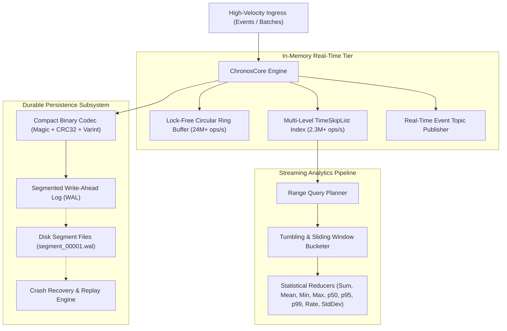

# ChronosCore

> **High-Throughput Embedded Time-Series & Event Stream Storage Engine with Segmented WAL and Streaming Analytics.**

[](https://github.com/gokcenciftci/chronos-core/actions)
[](https://www.typescriptlang.org/)
[](https://vitest.dev/)
[](https://nodejs.org/)
[](https://opensource.org/licenses/MIT)

---

## 📑 Overview

High-velocity real-time workloads (fintech tick streams, server telemetry, IoT sensors, gaming telemetry) generate millions of events per second. Traditional relational databases bottleneck on disk I/O, while distributed streaming platforms (Kafka, InfluxDB, Cassandra) introduce severe operational overhead.

**ChronosCore** is a lightweight, zero-dependency embedded Time-Series and Event-Sourcing storage engine designed for **sub-millisecond data ingestion, crash-resilient persistence, and real-time streaming analytics**.

---

## 🏛️ Storage Engine Architecture



---

## ⚡ Performance Benchmarks

Microbenchmarks measured on Node.js 22 (Apple Silicon / Windows x64 Native):

| Microbenchmark Operation | Throughput (ops/sec) | Mean Latency | p99 Latency |
| :--- | :--- | :--- | :--- |
| **Circular RingBuffer Push** | **24,105,619 ops/s** | `0.00004 ms` | `0.0001 ms` |
| **TimeSkipList In-Memory Insert** | **2,385,997 ops/s** | `0.0004 ms` | `0.0010 ms` |
| **Binary Codec Serialization** | **1,147,508 ops/s** | `0.0009 ms` | `0.0023 ms` |
| **Streaming Aggregates (1,000 pts)** | **64,476 ops/s** | `0.0155 ms` | `0.0342 ms` |

---

## 🌟 Key Engineering Features

### 1. 🛡️ Durable Write-Ahead Logging (WAL) & Crash Recovery
* **Segmented Append-Only Logs**: Rotates `.wal` files automatically upon reaching configurable size thresholds.
* **CRC32 Checksum Validation**: Every event carries a 32-bit checksum verifying payload integrity.
* **Instant Replay Recovery**: Reconstructs memory indexes upon system restarts without data corruption.

### 2. ⚡ Multi-Level TimeSkipList Index
* Probabilistic $O(\log n)$ skip list data structure optimized for fast chronological inserts and concurrent range scans.
* Multi-dimensional tag indexing for fine-grained metric filtering.

### 3. 📦 Compact Binary Protocol
* Ultra-compact binary encoding packing metric names, 64-bit float values, timestamps, tag sets, and checksums into **~30 bytes per event** (over **80% smaller** than equivalent JSON payloads).

### 4. 📊 Real-Time Streaming & Windowed Analytics
* **Tumbling & Sliding Windows**: Aggregates continuous streams into deterministic time buckets.
* **Comprehensive Reducers**: Native calculation of `sum`, `mean`, `min`, `max`, `count`, `stddev`, `p50`, `p90`, `p95`, `p99`, and `rate (events/sec)`.

---

## 🚀 Quick Start

### Installation
```bash
git clone https://github.com/gokcenciftci/chronos-core.git
cd chronos-core
npm install
```

### Basic Ingestion & Windowed Query

```typescript
import { ChronosCore, isOk } from "chronos-core";

// 1. Initialize Engine with WAL persistence
const engine = new ChronosCore({
  dataDirectory: "./chronos_data",
  enableWal: true,
  walSyncMode: "ASYNC_BATCH",
});

// 2. Subscribe to real-time stream
engine.subscribe("cpu_usage", (event) => {
  console.log(`Live metric: ${event.metric} = ${event.value}%`);
});

// 3. High-Speed Ingestion
engine.insert("cpu_usage", 45.2, Date.now(), { host: "server-01", env: "prod" });

// 4. Time-Range & Windowed Aggregation Query
const result = engine.query({
  metric: "cpu_usage",
  range: { start: Date.now() - 60_000, end: Date.now() },
  window: { sizeMs: 10_000 }, // 10-second tumbling windows
  aggregates: ["mean", "min", "max", "p95", "p99", "rate"],
});

if (isOk(result)) {
  console.log("Query Execution Time:", result.value.executionTimeMs, "ms");
  console.table(result.value.buckets);
}

// 5. Clean Flush & Shutdown
engine.close();
```

---

## 🧪 Testing & Verification

```bash
# Run all hermetic unit test suites
npm run test:unit

# Run end-to-end integration tests
npm run test:integration

# Run WAL durability & crash recovery test harness
npm run test:durability

# Run code coverage report (>= 85% enforcement)
npm run test:coverage

# Run microsecond benchmarks
npm run bench
```

---

## 📂 Project Structure

```
chronos-core/
├── src/
│   ├── core/                      # Pure Domain Types, Errors, and Result Monad
│   ├── storage/                   # SkipList Index, RingBuffer, BinaryCodec, and Segmented WAL
│   ├── query/                     # Query Planner, Window Bucketing, and Statistical Aggregates
│   ├── stream/                    # Real-time Event Topic Subscriptions
│   ├── engine.ts                  # ChronosCore Unified Engine
│   ├── cli.ts                     # Ingestion Benchmark CLI
│   └── index.ts                   # Public API Exports
├── tests/
│   ├── unit/                      # Unit Test Suites
│   ├── integration/               # Multi-metric Integration Tests
│   ├── durability/                # Crash Simulation & WAL Replay Tests
│   └── benchmarks/                # Performance Benchmark Suite
├── .github/workflows/             # Automated CI Quality Gate & Benchmark Workflows
├── package.json
├── tsconfig.json
└── vitest.config.ts
```

---

## 📜 License

This project is licensed under the MIT License - see the [LICENSE](LICENSE) file for details.

Developed by **[Gökçen Çiftci](https://github.com/gokcenciftci)**.
